# QA-Fundamental Project: Design, Develop and Deploy a CRUD application
The project is to design, develop and deploy an application to test and showcase the various tools, techniques and abilities that I have gained during my short time at the academy.

The application must allow the user to CREATE, READ, UPDATE AND DELETE the various fields/sections from a front-end system, that will apply changes directly to the back-end database system.

# Fishing Locations/Spots App

## Table of Contents
* [Brief](#brief)
  * [Requirements](#requirements)
    * [Scope](#scope)
    * [Platform Specific](#platform-specific-requirements)
* [Ideas](#ideas)
  * [Initial Idea](initial-idea)
  * [Final Idea](#final-idea)
* [Documentation](#documentation)
  * [Architecture](#architecture)
    *  [Database Structure](#database-structure)
    * [CI Pipeline](#ci-pipeline) 
  * [Project Tracking](#project-tracking)
  * [Risk Assessments](#risk-assessment)
  * [Testing](#testing)
  * [Front-End Design](#front-end-design)
  * [Known Issues](#known-issues)
  * [Future Improvements](#future-improvements)

### Brief
 The DevOps Fundamental project is designed to fully test and showcase my knowledge from the first half of the DevOps course. As such this project is to:

Create a CRUD application with utilisation of supporting tools, methodologies and technologies that encapsulate all core modules covered during training.

The Minumum Viable Product for this project is a fully complete web application built in python using the web-micro-framework Flask, that allows for the utilisation of Create, Read, Update and Delete functionality.

#### Requirements
 * A Kanban board tech element with full expansion on user stories, use cases and tasks that are needed to complete the project
* A relational database used to store data persistently for the project, with at least 2 tables within it, consiting of two or more one-many relationships.
* Clear documentation from a design phase describing the architecture used for the project, as well as a detailed Risk Assessment
* A functional CRUD application, created in python, following best practices and design principles, thast meets the requirements set on the Kanban Board.
* Fully designed test suites for the application, as well as automated tests for validation of the application. High test coverage must be acheived for the back-end with consistent reports and evidence to support a test driven development approach.
* A functioning front-end website and integrated API's using Flask.
* Code fully integrated into a Version Control System using the Feature-Branch model which will subsequently be built through a CI server and deployed to a cloud-based virtual machine.

##### Scope
##### Platform Specific Requirements
* Kanban Board (Trello or other equivalent)
* Database: GCP SQL Server or other Cloud Hosted managed Database
* Progamming Language: Python
* Unit Testing with Python: Pytest
* Integration Testing with Python (Selenium)
* Front-end: Flask micro-framework (HTML)
* Version Control: Git
* CI Server: Jenkins
* Cloud server: GCP Compute Engine

### Ideas
* Artwork Sharing App - Share artwork around the world that interests you.
* Fishing Location/Spots App - Share your individual catches, showcase your best catches to the world.
* Recipe Sharing App - Share your individual recipes, rate others' recipes, showcase the most highly rated recipes for each category/style of food.
* Fake society - Create profiles of virtual fictional beings, with various occupations and highly detailed information.

#### Initial idea
##### Chosen Idea: Fishing Locations/Spots App
Reasoning for choice: Fishing is an activity which has been enjoyed for thousands of years throughout all eras of society. There is a marketability in such an idea and also a high level of personal interest within the subject.

A fishing app can very easily satisfy the MVP requirements of the project and more, whilst producing a marketable, expandable application that many around the world could find useful and/or rewarding.From a personal perspective this subject area should provide a fun and interesting challenge to showcase the skills learned thus far in the QA Academy.

#### Final idea
##### Fishing Locations/Spots
A web app where users can log the various fish that they have caught and feel are worthy of sharing, along with the relevant information from the catch, such as location, how long the catch took.

An app like this would meet the CRUD functionality requirement by allowing:
* Create: 1. User Profiles (Username, ID(Auto-generated on submission of the form), password, forename, surname, Email, Gear List (Optional), Amount of catches, Amount of top catches.
 * 2. "Catch Diary" - Log of each fish caught, containing (Fish Name/Species, Weight, Time to catch, Date of catch, Weather during catch (Optional), Top Catch (Boolean that checks if the new value is larger than the previous max weight in the database for a specific fish ID), finally they will be able to enter a description of theencounter (Optional)
* Read: Users are able to view the catch diary and search for any catches that are assigned to their ID, shown on their profile once it is created. Users are also able to view the Fish Log, which shows the minumum, maximum and average weight values for all fish within the database.
* Update: Users are able to update their own user profile, as well as the description of any catch they have made.
* Delete: Users are able to delete their user profile, though the catch diary may remain unchanged.

###### Possible User Stories/Journey
1. User catches fish at sea/fishing spot
2. User registers on web app
3. User logs in using registered username and password - Application shows their personalised profile.
4. User navigates to "catches" and enters a "new catch" containing all relevant information, with the species name/id and weight of the fish, time to catch the fish and date of the catch, with optional descriptive fields if the user wishes to enter detail. The User ID is taken from the User profile, while the Catch ID is automatically generated, likely implementing an e-numerator process.
* 4a Compute Process - Fish Species/Weight are taken from the new catch and compared to the fish "dictionary" if the ID does not exist a new record is made, if it does exist the following occurs: If max weight beats the previous max of that fish it is registered as a top catch and the user ID is attributed (For that specific fish ID)
5. User wishes to view their various catches - Read the catch diary and retrieve all catches which are linked to their specific username/user ID.
6. User wishes to delete their profile - User navigates to their user profile and sees that their catches are not very good, and would like to delete their profile to hide their presence. To do this the user would simply click on a delete button on their user profile, which will drop the record from the database and any subsequent records that they are involved in. Any of their top catches will be deleted, with the 2nd highest value becoming the first highest.

### Documentation

#### Architecture

##### Database Structure
o begin planning for a managed relational database the data involved for the app had to be brainstormed and recorded, below is the initial draft of the possible fields which may be required for an app of this nature.
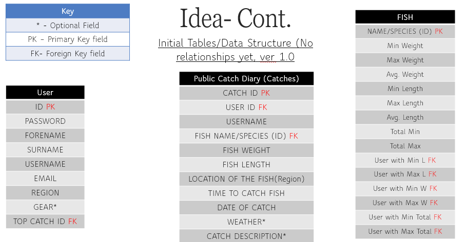
The Data above covers the tables and fields that I felt would be necessary at the beginning of the project, without thinking about the data types, or any specific relationships at the time. 3 entities, each with many fields and the primary/foreign keys which may be required.

This initial dataset was trimmed down to a more managable size and it's format was altered to fit that of what a regular entity relationship diagram would look like. Below is V 1.1 of the data structure.

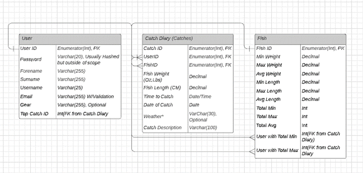
As can be seen, this ERD is quite complex with rather ambiguous relationships, and will likely need to be further trimmed to ensure that the MVP CRUD functionality is met. It is worth noting that any trimmed fields/data can likely be re-introduced in a future sprint.

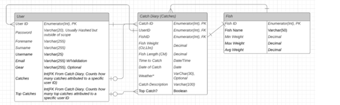
This version of the database structure is a simplified version of the above, which illustrates much clearer relationships between the tables.

* Each User is attributed to zero or one to many catches
* Each User can be attributed to zero or one to many top catches
* Each Catch can contain only one fish, however fish with the same ID can be present in many catches
* Top Catches are calculated by comparing a newly enetered catch into the catch diary with the catches that are already present, if the new catch has a higher weight value, it is attributed as the new top catch, and the top catch is added to the user profile.

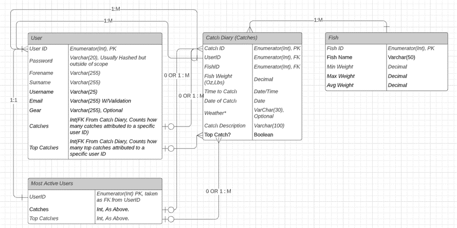
The final version of the database structure slightly changes the previous, with a simple "Most active users" addition and with even more clear relationships, via the use of notation to the branches. The most active users table was added into the database structure to make the database feel more complete and add to the user experience. 

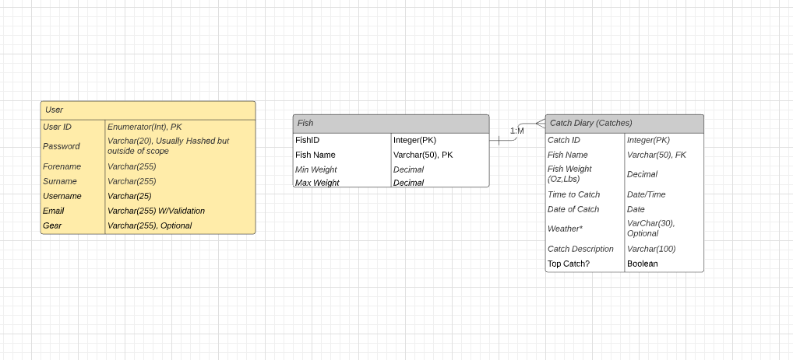
After revisions, the design has been greatly simplified for the first sprint, to deliver the MVP as expected. a single one to many relationship can be seen between the Fish and Catches table, with the fish ID linking the two together. The User table has been marked for use in future sprints, indicated with the yellow colouring.

##### CI Pipeline
#### Project Tracking
The project has been tracked as specified using a kanban style board, using Trello, which can be found [Here](https://trello.com/b/mVD3VaEn/sprint-1-two-week-duration). The Sprint will last/lasted two weeks, starting on the 6th December and Ending on 20th December. By the end of the first week all Documentation should be complete, and by the end of the Second week the MVP will be able to be delivered to the client as specified.

Update 17th Dec: Project deadline has been extended to January, as such the sprint has been modified and the timescales have been adjusted. 

#### Risk Assessment
 The Risk Assessment for the Project can be found in full [Here](https://docs.google.com/spreadsheets/d/1hfYDhvG_HrHr0DTENwdTv7SPDeCxY9-hMgxS1r_XXLA/edit#gid=0)

Below is an image of most of the inititial risk assessment, likely to be expanded upon before the end of the project.
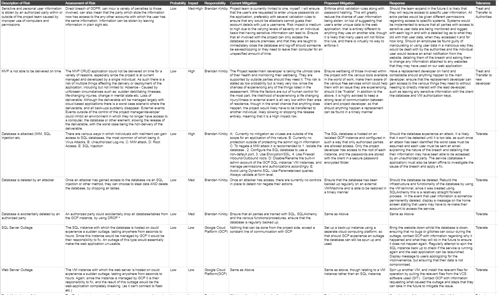
#### Testing
The project achieved the minumum viable product by utilising two testing methods, Unit Testing (Pytest) and Integration testing (Selenium). The following section will detail the testing process and how the total coverage of 70% was met for the unit tests, and how in future 100% coverage could be achieved.
##### Unit-Testing
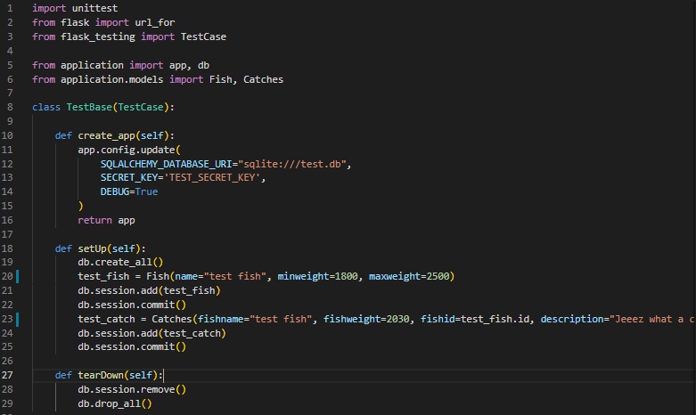
To begin unit tests the relevant imports must be made, which are the unittest module from Python, flask and flask_testing to import url_for and TestCase (which is the foundation to run all unit tests, after setting up the TestBase to use TestCase). finally the app and the database is imported, along with the relevant models to be tested.

Once all imports are complete the TestBase is set up, the first function to run is similar to that within the init.py file, and assigns the database properties for the temporary database to use. SQLite was used in this instance so that the main database did not get affected.

Finally, the SetUp and tearDown functions are assigned, with the self argument passed through. These functions create and populate the database and remove the database, and are run independantly for each test. this ensures that each test is working with the same set of data.

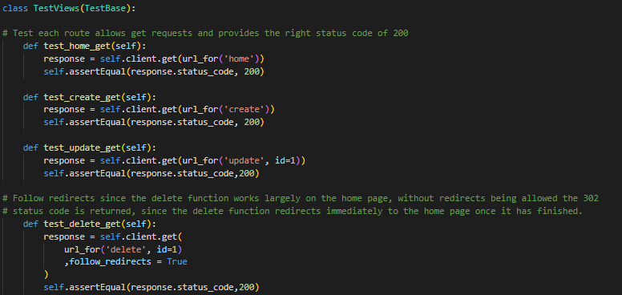
With the set-up complete the first thing to test is flask, to ensure that the routes are working as intended and sending back the right status codes, 200 means a successful get request. These tests are asserting that when a user navigates to the url_for('page name') that they are sent there and that the app recognises this. The delete get requests has to allow redirects as the delete function contains a redirect to the home page, allowing for the user to delete an endless amount of posts on the homepage without the page refreshing etc.

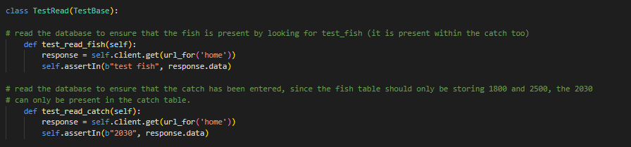
With the routes tested, next is the read functionality within flask. the functions within this test parse through the home page via a get request, and assert that a specific data set will be in the response data. since fish and catches are sharing the majority of their data, the catch entered has different values than those stored within the fish table. As such by ensuring that both "test fish" and the catch fishweight of 2030 are present on the home page, the database is working correctly and flask is displaying the right information.

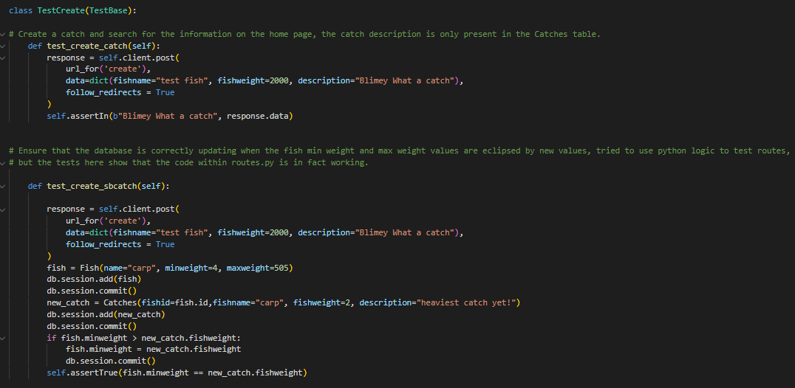
The create functionality of the app was tested in two seperate ways (though only one affects the coverage report). The first thing that it does is act as a user and send a post request to the create route, entering the data that is required from the user as a new catch, from there it would redirect to the home page, allowing the assertion to test that the data entered in the post request is now in the response data of the home page.

The second function within the create test case is designed to test the logic within the database, and mirrors the functionality found within the routes file. Due to personal inexperience with assertions and unit testing I was not able to directly test the logic within the routes.py file, and instead opted to test the logic within the unit tests by asserting that by running the exact same code, the database values will be updated if the weight of a new catch eclipses the previously stored minumum or maximum values of the fish with the id that matches that within the catch.

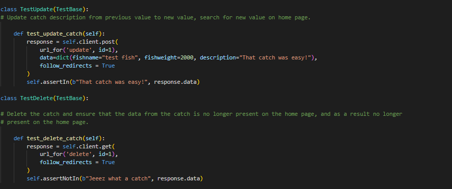
Finally with the main functions tested is the last two routes of the CRUD application, Update and Delete. The tests for these is very similar, and asserts that when the user navigates to the update link, and attempts to update the previously existing catches to description, that the description will change to the new description entered within the post request, by using a get request to parse the home page for the new description.

The Delete route works in a similar way, but instead of asserting that the catch data is in the home page, it asserts that by the user navigating to the delete route, and deleting the catch with the associated ID that the catch will no longer be present upon redirecting to the home page.

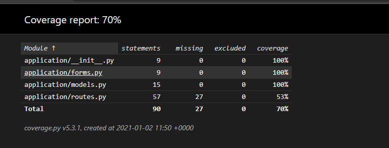
As can be seen, the unit tests have tested most functionality within the application, with only 53% of the lines within the routes being tested, which is attributed to the python logic mentioned earlier. In the future with more knowledge of assertions and unit testing in general, 100% coverage would be highly achievable.

##### Integration Testing with Selenium
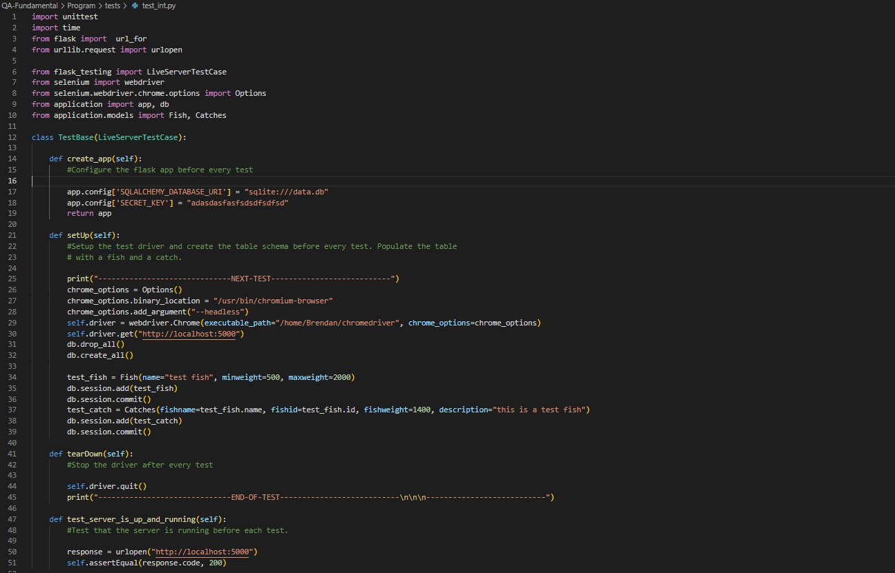
Import all relevant modules for testing purposes, Create the testbase using a mock database as with Unit testing. The set-up primarily focuses on setting up the Selenium crhomium driver, and dropping, creating and populating the test database. The first test asserts that the driver is up and running on localhost:5000, verifying it with a response code of 200.
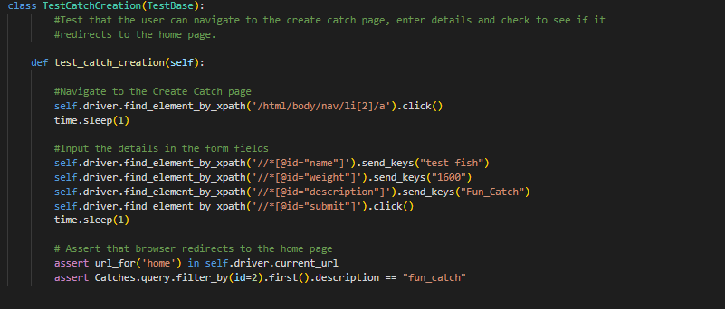
Use the selenium chrome driver to target the navigation element of the home page, click the add catch button, and populate the form with the required data.
assert that the user is redirected to the home page, and assert that a new Catch is present, by searching for id=2 and targeting the description attribute, when the database was only set up with a single catch.
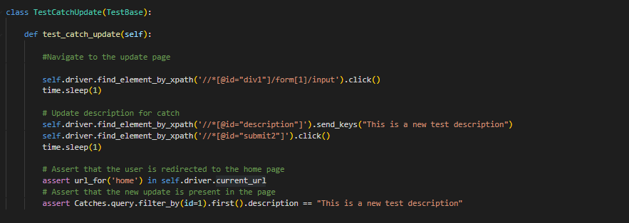
Same as above but relating to the update function, does not create a new catch and instead updates the existing catch with a new description. Test asserts that the user has been redirected to the home page
on form completion, and that the new description is the only description present.
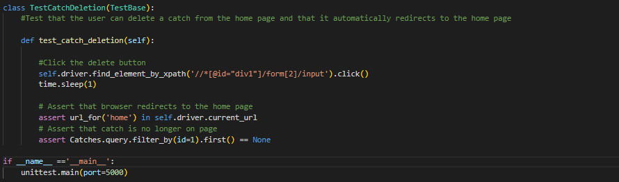
The final integration test is to test the delete buttons present on each catch. Selenium is used to target the delete element, and the assertion is made that the Catch table's first entry now returns a None type Object.
If statement at the bottom to run the live server.

#### Front End Design
#### Known Issues
#### Future Improvements
